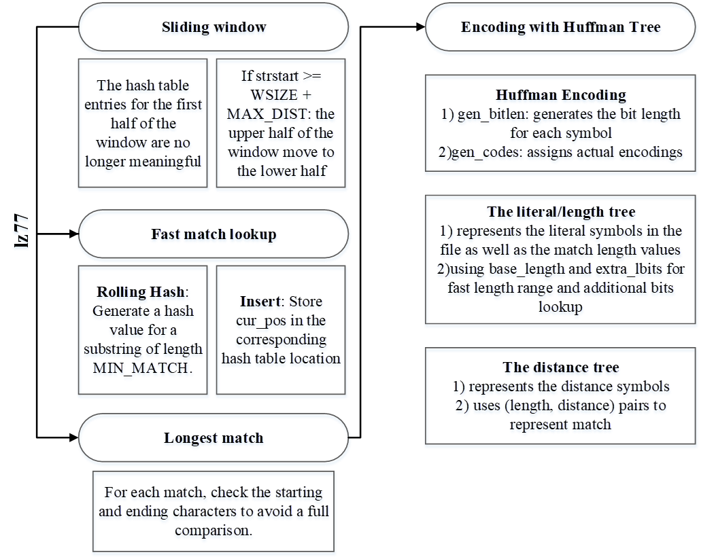

# Rust Reconstruction of Gzip Using LLM (Incomplete)

## Overview

This project aims to reimplement Gzip in Rust from https://github.com/kunpengcompute/gzipC, using ChatGPT 4o.

## Workflow

### 1. Extracting Functions from C Code

Using `ctags`, I extracted all the functions from the C project, including their file locations and definitions. The output looked like this:

```
xsum    lib/xsize.h   /^xsum (size_t size1, size_t size2)$/;"   f
xsum3   lib/xsize.h   /^xsum3 (size_t size1, size2, size3)$/;"  f
xsum4   lib/xsize.h   /^xsum4 (size_t size1, size2, size3, size4)$/;"  f
xunlink util.c   /^int xunlink (filename)$/;"    f
xzalloc lib/xmalloc.c    /^xzalloc (size_t s)$/;"    f
yesno   lib/yesno.c   /^yesno (void)$/;"    f
zip zip.c   /^int zip(in, out)$/;"  f
...
```

### 2. Structuring the Rust Project with LLM Assistance

I then fed this `tags` file to the LLM to help design the Rust project architecture. Based on the output, the suggested structure for the Rust project was as follows:

```
my_project/
├── Cargo.toml           # Project configuration and dependencies
└── src/
    ├── main.rs          # Main entry point for the executable
    ├── lib.rs           # Library entry point, defining the core API
    ├── compression/
    │   ├── mod.rs       # Module file for compression functions
    │   ├── deflate.rs   # Deflate algorithm implementation
    │   ├── lm_init.rs   # Longest match initialization
    │   └── utils.rs     # Helper functions for compression
    ├── decompression/
    │   ├── mod.rs       # Module file for decompression functions
    │   ├── inflate.rs   # Inflate algorithm implementation
    │   └── huft.rs      # Huffman tree management
    ├── util/
    │   ├── mod.rs       # Utility module
    │   ├── crc.rs       # CRC calculation functions
    │   ├── file_io.rs   # File handling utilities
    │   └── error.rs     # Error handling functions and types
    └── tests/
        └── integration.rs # Integration tests for compression and decompression
```

### 3. Generating Rust Code from C Functions

I then prompted the LLM to provide details on each file under `my_gzip`, including which functions to include and where to source them from in the original C code. Based on the LLM’s suggestions, I iteratively fed in relevant C code files, requesting both a  translation and adjustments.

### 4. Testing and Debugging

To validate the code, I used the following commands:

```
cargo test
cargo run --bin my_gzip example.txt
```

I iterated between LLM suggestions and manual adjustments. This allowed me to reach a point where the code compiled and ran, albeit with logical errors. For instance, compressing a 74KB file resulted in a 7991KB output—definitely not what I expected!

### Debugging

Initially, I relied heavily on LLM feedback to resolve compilation errors.  Common errors include:

1. **Inter-file Function References**: Issues with function visibility, requiring changes like `pub` modifiers and resolving undefined symbols.
2. **Incomplete Function Implementations**: LLM frequently generated function stubs without implementing the internal logic.
3. **Name Conflicts**: The LLM sometimes confused variables within a struct with similarly named external variables.
4. **Data Type Mismatches**: Parameters often had mismatched types (e.g., `u8` vs. `u16`, or `Option` types) due to LLM’s inconsistent handling of type requirements.

For this phase, I relied mainly on the LLM for guidance.

### Transition to Manual Debugging

As I continued, I moved to manual debugging, utilizing `rust-gdb` and delving into the C source code for a deeper understanding.

The following diagram is based on notes I took while reading through the source code. 



One interesting bug that may highlight the limitations of LLM:

According to LLM, `match_pos = 0` was interpreted as no occurrence due to the hash table containing a `0`. 

However, `match_pos = 0` should actually trigger a check on `window[match_pos]` == `window[strstart]`, distinguishing whether it’s genuinely appearing for the first time at index 0, or if it hasn’t appeared at all, given that the hash table is initialized with all zeroes.
